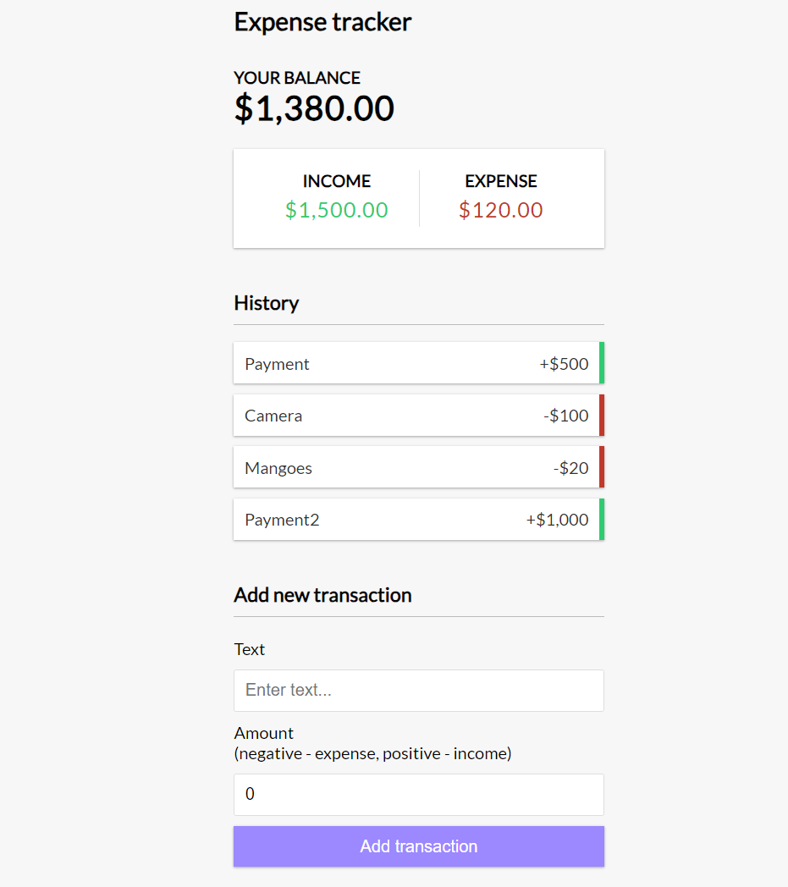

# Expense Tracker App

Using MERN stack to make a simple Expense Tracking App.

## About MERN

***MongoDB:***

MongoDB is a NoSQL database that stores data in a flexible, document-like format called BSON (Binary JSON). It's designed to handle large volumes of data and is particularly well-suited for applications with dynamic and changing data structures.
MongoDB uses collections to group related documents, which are stored in a format similar to JSON objects.
It's schema-less, meaning each document in a collection can have a different structure.

***Express.js:***

Express.js is a web application framework for Node.js. It simplifies the process of building robust and scalable APIs by providing various features and tools.
It helps manage routes, middleware (functions executed during request/response lifecycle), handling requests and responses, and more.
Express.js makes it easier to handle HTTP requests, define routes, and manage various aspects of the server-side logic.

***React:***

React is a JavaScript library for building user interfaces. It's focused on creating reusable UI components that efficiently update when data changes.
React follows a component-based architecture where the UI is divided into individual components, each responsible for its own logic and rendering.
React uses a virtual DOM to optimize rendering by minimizing actual DOM manipulation.

***Node.js:***

Node.js is a server-side JavaScript runtime that allows you to build scalable and efficient network applications.
It uses an event-driven, non-blocking I/O model, which makes it suitable for applications that require high concurrency.
Node.js can be used to build server-side APIs, handle file operations, perform database interactions, and more.

## Flow of Project

The flow of a MERN application is as follows:

***Front-End (React):***

The user interface of the application is built using React components.
React components can be organized into a hierarchy, and they manage their own state and rendering logic.
Components can communicate with each other through props (properties) and by using a global state management library like Redux.

***Back-End (Node.js and Express.js):***

The back-end handles HTTP requests from the front-end and performs necessary operations like fetching data from the database.
Express.js helps define API routes, middleware, and business logic for processing requests.
Node.js provides a runtime environment for the server-side code to execute.

***Database (MongoDB):***

MongoDB stores the application's data in a NoSQL format.
Data is organized into collections, and each collection contains documents with varying structures.
The back-end interacts with the database to perform CRUD (Create, Read, Update, Delete) operations.

## Project Logs
- ```npx create-react-app expense-tracker-app```
- Installed the VSCode Extension: ES7 React/Redux/GraphQL/React-Native snippets
- create components folder inside src -> create Header.js file
- type 'rafc' in header.js -> it will give us a functional component to work with
- Import Header.js in App.js
- Create rest of the components and include it in App.js
- Add extension: React DevTools in Chrome to inspect React Components
- React Context folder created with GlobalState and AppReducer files in it for managing global state that needs to be shared and accessed by multiple components throughout the application.

    ### Code Explanation (GlobalState.js and AppReducer.js)
    initialState: This is an object that represents the initial state of the application. It contains a transactions array with some sample transaction objects, each having an id, text, and amount property. This will serve as the starting point for the application's state.

    createContext: This function is used to create a new React context called GlobalContext. The initialState object is passed as the default value for this context, which means any component that consumes this context will have access to the transactions array in their initial state.

    GlobalProvider: This is a custom component that acts as the provider for the GlobalContext. It wraps its child components and makes the global state available to them via the GlobalContext.Provider. Within this component, the useReducer hook is used to create a state management mechanism with a reducer function called AppReducer. The AppReducer is responsible for handling state updates based on dispatched actions.

    value prop in the GlobalContext.Provider: Here, the transactions array from the state managed by useReducer is exposed through the context, making it accessible to all the child components that consume this context.

    **The Global Context (created with createContext) serves as a way to declare a "global store" for your application's state. It allows components to consume the state without having to pass it down through prop drilling. However, just having the context without a provider would mean that you don't have a way to manage and update the state effectively.**

    **The Global Provider, on the other hand, is a component that wraps your application (or parts of it) and acts as a container for the global state. It is responsible for providing the state and methods to update the state to all the child components that consume the context.**

    **By using the Global Provider with useReducer (or other state management techniques like useState or Redux), you have a mechanism to handle state updates and maintain a single source of truth for the entire application. The provider holds the state and dispatch function (for updating the state), and it makes them available through the context.**

- Added GlobalContext to TransactionList.js
- Made Transaction.js so that it can be used as a component in TransactionList.js
- Added GlobalContext to IncomeExpenses.js and Balance.js
- Deleting a Transaction
- Adding a Transaction

**Backend Implementation**
- Moved react files to ```client``` folder
- Run ```npm init``` from root

```cmd
npm init
This utility will walk you through creating a package.json file.
It only covers the most common items, and tries to guess sensible defaults.

See `npm help init` for definitive documentation on these fields
and exactly what they do.

Use `npm install <pkg>` afterwards to install a package and
save it as a dependency in the package.json file.

Press ^C at any time to quit.
package name: (expense-tracker-app)
version: (1.0.0)                                                                                                                                             
description: Backend for expense tracker                                                                                                                     
entry point: (index.js) server.js                                                                                                                            
test command:                                                                                                                                                
git repository: (https://github.com/AnuragBambardekar/Expense-Tracker-GUI.git)                                                                               
keywords:                                                                                                                                                    
author: Anurag B                                                                                                                                             
license: (ISC)          
```

- Install dependencies: 
```cmd 
npm i express dotenv mongoose colors morgan
```

- Install dev dependencies
```cmd
npm i -D nodemon concurrently
```

- Add run commands in package.json
```
"scripts": {
    "start": "node server",
    "server": "nodemon server"
},
```

- Create server.js in root
- Server setup done
- Create a routes folder and create transactions.js file

- Create a Database on MongoDB - Atlas
- Choose connection method - VSCode
- Copy the connection string to the config.env file.
- Create a db.js file and configure the DB
- Get transactions from the DB by adding the relevant code in controllers/transaction.js
- Add a transaction to the DB, also used validation via Mongoose (via the models that we created).
- Delete a transaction from the DB using findById() and deleteOne()

### Connecting front-end and back-end using concurrently

- Go to package.json under client folder and add a proxy ("proxy":"http://localhost:5000")
- Go to package.json under server directory and add scripts to run client and server using concurrently.
```
"scripts": {
    "start": "node server",
    "server": "nodemon server",
    "client": "npm start --prefix client",
    "dev": "concurrently \"npm run server\" \"npm run client\""
  },
```

- cd to client and install axios 
```cmd
npm i axios
```
- Use axios to fetch API 
- So, go to GlobalState.js file and this is where we will be implementing all the requests through actions, and we won't be using the ```state``` variable.
- Also add the new cases to implement the actions for getTransactions and TransactionError in the AppReducer.js
- Use the getTransaction action in TransactionList.js component

- Use morgan in server.js to see the methods, URL, response status and the time it takes.

- Go to Transaction.js & AppReducer.js to handle the DeleteTransaction service (.id to ._id)
- Make the calls to the backend for Deleting a Transaction

- Add a transaction via GlobalState.js file

**On MongoDB, we need to whitelist the IP that we are using on MongoDB interface.**

- Add the feature: numbers with commas --> create utils folder
- Add the numbers with commas feature in places where there is amount being displayed on the page.

### Create a build folder for deployment

- Go to ```client``` folder and run 
```cmd 
npm run build
```

- Change NODE_ENV to production in config.env
- add path module in server.js and below the API routes
- now we can run ```npm run server``` and then if we go to ```localhost:5000``` we can see the ```index.html``` file rendered on the browser.
- Now we can deploy it on heroku/netlify.

# Screenshots



# References
- https://www.youtube.com/watch?v=XuFDcZABiDQ - React Expense Tracker
- https://www.youtube.com/watch?v=KyWaXA_NvT0 - MERN Expense Tracker